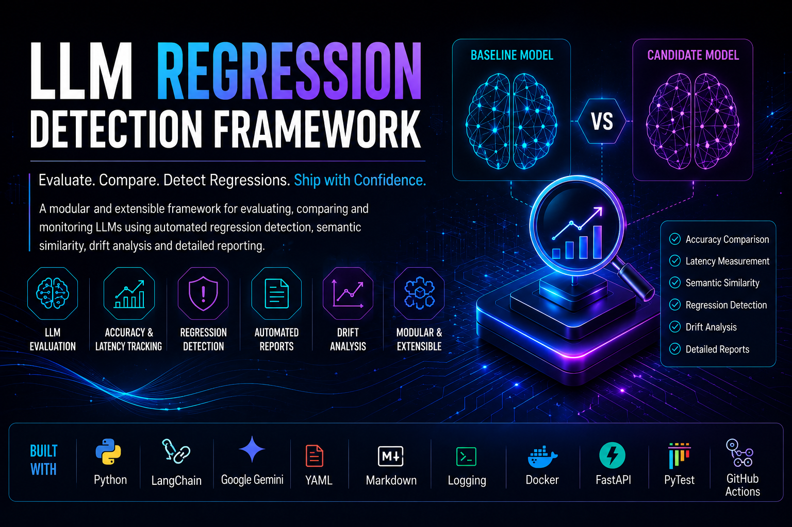
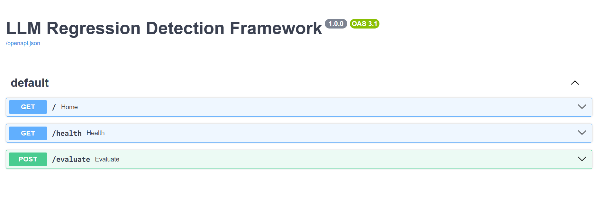
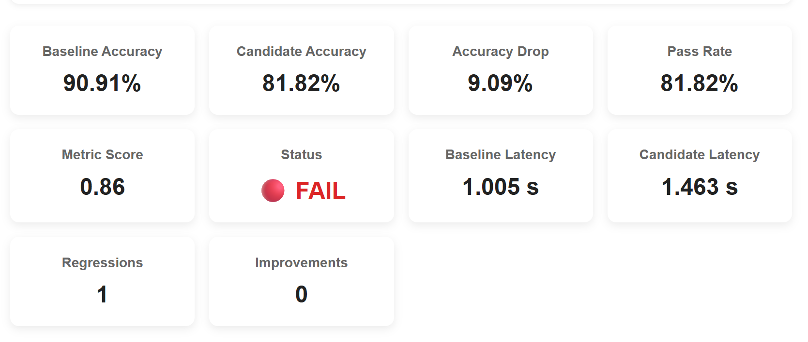
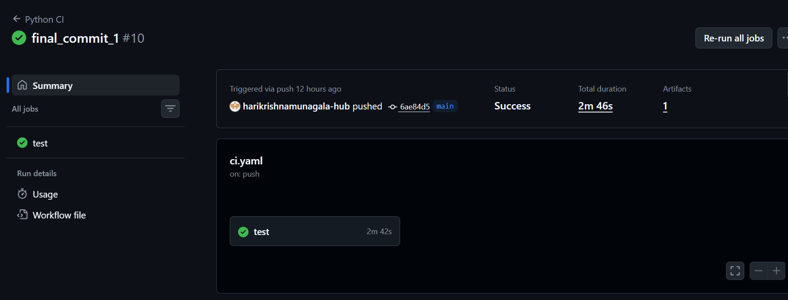
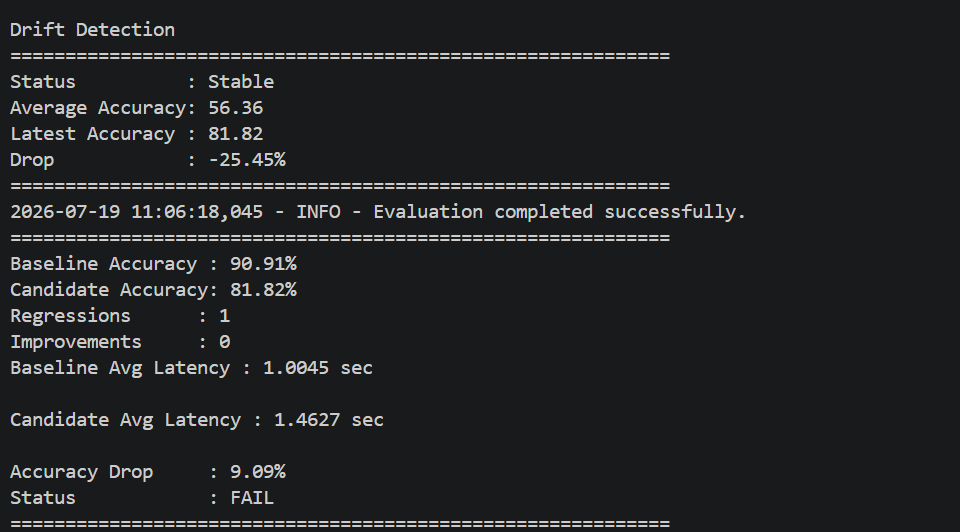
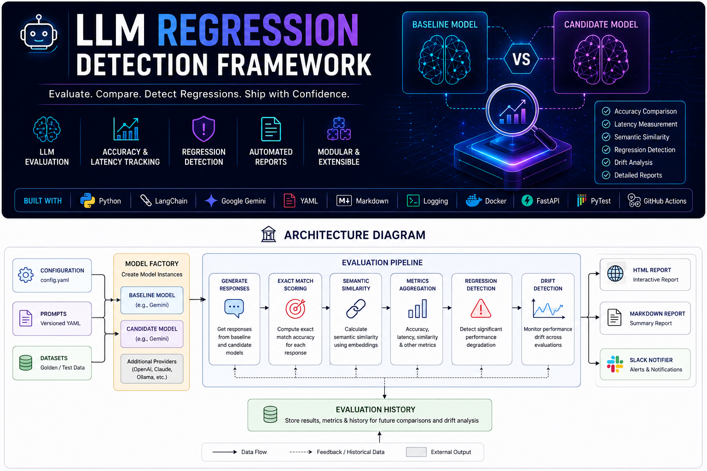

<p align="center">
  
</p>

<h1 align="center">
🤖 LLM Regression Detection Framework
</h1>

<p align="center">
Production-inspired framework for evaluating, comparing, and monitoring Large Language Models with automated regression detection, semantic scoring, drift analysis, and CI/CD.
</p>

<p align="center">


</p>

---

# 📖 Overview

Large Language Models continuously evolve through prompt engineering, fine-tuning, and new model releases. While these changes often improve overall performance, they can also introduce subtle regressions—responses that were previously correct may become incorrect, slower, or less semantically accurate.

The **LLM Regression Detection Framework** automates the evaluation process by comparing a **baseline model** against a **candidate model** on a configurable golden dataset. It measures response quality, latency, semantic similarity, and performance drift while generating detailed reports for analysis.

Designed with modularity and extensibility in mind, the framework demonstrates production-style software engineering practices for building reliable LLM evaluation pipelines.

---

# ✨ Features

## 🧠 LLM Evaluation

- Compare baseline and candidate models
- Golden dataset evaluation
- Exact Match scoring
- Semantic Similarity scoring
- Configurable evaluation thresholds
- Prompt versioning support

## 📊 Performance Monitoring

- Accuracy benchmarking
- Latency measurement
- Regression detection
- Drift detection
- Evaluation history tracking
- Automatic performance summaries

## 📄 Reporting

- HTML evaluation reports
- Markdown reports
- Structured logging
- Detailed regression summaries
- Failed test case analysis

## ⚙️ Engineering Features

- Provider-based model architecture
- Factory Design Pattern
- YAML-driven configuration
- FastAPI REST API
- Docker support
- GitHub Actions CI
- PyTest unit tests
- Optional Slack notifications
- Easily extensible to new providers and scorers

---

# 🎯 Why This Project?

Modern AI applications require continuous evaluation before deploying new prompts or model versions. Even a small update can unintentionally degrade model performance.

This framework provides a repeatable evaluation workflow that enables developers to:

- Detect regressions before deployment
- Compare multiple LLM versions
- Measure quality and latency
- Track historical performance
- Automate evaluation inside CI/CD pipelines

The project combines **LLM engineering** with **software engineering best practices**, making it suitable for production-inspired AI workflows.

---

# 🚀 Key Highlights

- ✅ Multi-provider architecture
- ✅ Factory Design Pattern
- ✅ Configuration-driven development
- ✅ Automated regression detection
- ✅ Semantic similarity evaluation
- ✅ Drift analysis
- ✅ FastAPI REST API
- ✅ Dockerized deployment
- ✅ GitHub Actions CI pipeline
- ✅ Extensible and modular design

---

# 📸 Project Demo

The framework provides multiple ways to inspect evaluation results and monitor model performance.

| FastAPI API | HTML Report |
|-------------|-------------|
|  |  |

| GitHub Actions | Console Output |
|----------------|----------------|
|  |  |

> **Note:** Replace the screenshots above with actual images from your project.

---

# 🏗️ Architecture

<p align="center">
    
</p>

The framework follows a modular architecture that separates model providers, evaluation logic, scoring, reporting, and monitoring into independent components.

This design makes it easy to integrate new LLM providers, scoring algorithms, or reporting systems without modifying the evaluation pipeline.

---

# 🔄 Evaluation Workflow

```text
                         config.yaml
                              │
                              ▼
                    Load Configuration
                              │
                              ▼
                 Initialize Model Factory
                              │
                ┌─────────────┴─────────────┐
                ▼                           ▼
        Baseline Model              Candidate Model
                │                           │
                └─────────────┬─────────────┘
                              ▼
                   Load Golden Dataset
                              │
                              ▼
                    Generate Responses
                              │
                              ▼
               Exact Match Evaluation
                              │
                              ▼
             Semantic Similarity Scoring
                              │
                              ▼
             Accuracy & Latency Metrics
                              │
                              ▼
              Regression Detection Engine
                              │
                              ▼
                 Performance Drift Check
                              │
                              ▼
               Store Evaluation History
                              │
                              ▼
              Generate HTML & Markdown Reports
                              │
                              ▼
                 FastAPI Response / CI Pipeline
```

---

# 📂 Project Structure

```text
LLM-Regression-Detection-Framework/
│
├── .github/
│   └── workflows/
│       └── ci.yaml                # GitHub Actions CI pipeline
│
├── assets/
│   ├── banner.png
│   ├── architecture.png
│   └── report_sample.png
│
├── config/
│   └── config.yaml                # Framework configuration
│
├── datasets/
│   ├── golden_dataset.json
│   └── test_data.json
│
├── history/
│   └── evaluation_history.json
│
├── prompts/
│   ├── v1.yaml
│   └── v2.yaml
│
├── reports/
│   ├── evaluation_report.md
│   └── report.html
│
├── src/
│   ├── models/
│   ├── scorers/
│   ├── config.py
│   ├── datasets.py
│   ├── drift_detector.py
│   ├── evaluator.py
│   ├── history.py
│   ├── html_report.py
│   ├── logger.py
│   ├── model_factory.py
│   ├── prompt_loader.py
│   ├── regression.py
│   ├── report.py
│   └── slack_notifier.py
│
├── templates/
│   └── report.html
│
├── tests/
│   ├── test_config.py
│   └── test_regression.py
│
├── api.py
├── Dockerfile
├── requirements.txt
├── LICENSE
└── README.md
```

---

# 🧩 Core Components

| Component | Responsibility |
|-----------|----------------|
| **Model Factory** | Creates baseline and candidate model instances dynamically. |
| **Prompt Loader** | Loads versioned prompts from YAML files. |
| **Evaluator** | Executes the end-to-end evaluation pipeline. |
| **Regression Detector** | Detects quality degradation between model versions. |
| **Drift Detector** | Monitors evaluation drift across runs. |
| **History Manager** | Stores historical evaluation results for comparison. |
| **Scorers** | Computes Exact Match and Semantic Similarity scores. |
| **HTML Report Generator** | Produces interactive evaluation reports. |
| **Markdown Report Generator** | Generates lightweight evaluation summaries. |
| **Slack Notifier** | Sends optional evaluation summaries to Slack. |
| **FastAPI API** | Exposes evaluation endpoints for external applications. |

---

# 🏛 Design Principles

The framework is built around modern software engineering practices commonly used in production AI systems.

### Separation of Concerns

Each module has a single responsibility, making the codebase easier to maintain and extend.

### Factory Design Pattern

The `ModelFactory` abstracts model creation, allowing new providers to be integrated without changing the evaluation pipeline.

### Configuration-Driven Development

Framework behavior is controlled through YAML configuration files rather than hardcoded values.

### Extensibility

New LLM providers, scorers, prompts, or reporting modules can be added with minimal code changes.

### Reproducibility

Versioned prompts, evaluation history, and structured reports ensure evaluation runs can be reproduced and audited.

---

# ⚡ Quick Start

## 1️⃣ Clone the Repository

```bash
git clone https://github.com/<your-username>/LLM-Regression-Detection-Framework.git

cd LLM-Regression-Detection-Framework
```

---

## 2️⃣ Create a Virtual Environment

### Windows

```bash
python -m venv venv

venv\Scripts\activate
```

### Linux / macOS

```bash
python3 -m venv venv

source venv/bin/activate
```

---

## 3️⃣ Install Dependencies

```bash
pip install -r requirements.txt
```

---

## 4️⃣ Configure Environment Variables

Create a `.env` file in the project root.

```env
GOOGLE_API_KEY=YOUR_GEMINI_API_KEY

# Optional
SLACK_WEBHOOK_URL=YOUR_SLACK_WEBHOOK
```

> **Note:** Slack integration is optional. If no webhook is provided, notifications are skipped automatically.

---

## 5️⃣ Configure the Framework

The framework behavior is controlled using:

```text
config/config.yaml
```

Example configuration:

```yaml
baseline_model:
  provider: gemini
  model_name: gemini-2.5-flash

candidate_model:
  provider: gemini
  model_name: gemini-2.5-flash

dataset: datasets/golden_dataset.json

prompt_version: v2

regression_threshold: 5

semantic_threshold: 0.85
```

---

## 6️⃣ Run the Evaluation

```bash
python api.py
```

The framework will:

- Load the configuration
- Initialize models
- Load prompts
- Evaluate the dataset
- Calculate Exact Match scores
- Calculate Semantic Similarity
- Detect regressions
- Detect performance drift
- Save evaluation history
- Generate HTML and Markdown reports

---

# 🌐 FastAPI API

After starting the application, open:

```
http://127.0.0.1:8000/docs
```

Interactive Swagger documentation is automatically available.

---

## Available Endpoints

| Method | Endpoint | Description |
|---------|----------|-------------|
| GET | `/` | Root endpoint |
| GET | `/health` | Health check |
| POST | `/evaluate` | Run a complete evaluation |

---

## Example Request

```http
POST /evaluate
```

Example Response

```json
{
    "status": "PASS",
    "baseline_accuracy": 90.0,
    "candidate_accuracy": 88.0,
    "accuracy_drop": 2.0,
    "semantic_similarity": 0.94,
    "regression_detected": false,
    "drift_detected": false,
    "report": "reports/report.html"
}
```

---

# 🐳 Docker

Build the Docker image:

```bash
docker build -t llm-regression-framework .
```

Run the container:

```bash
docker run -p 8000:8000 \
-e GOOGLE_API_KEY=YOUR_API_KEY \
llm-regression-framework
```

---

# 🧪 Running Tests

Execute the unit tests using PyTest.

```bash
pytest
```

GitHub Actions automatically executes these tests on every push and pull request to ensure the framework remains stable.

---

# 📊 Generated Outputs

After each evaluation, the framework automatically generates:

```
reports/
│
├── report.html
└── evaluation_report.md

history/
└── evaluation_history.json
```

These outputs provide:

- Accuracy comparison
- Semantic similarity scores
- Regression status
- Drift analysis
- Failed test cases
- Historical evaluation records

# 📈 Sample Evaluation Output

```text
==============================================================
                LLM Evaluation Summary
==============================================================

Baseline Model          : Gemini 3.5 Flash Lite
Candidate Model         : Gemini 3.5 Flash Lite

Total Test Cases        : 20

Baseline Accuracy       : 90.09%
Candidate Accuracy      : 90.09%

Semantic Similarity     : 0.94

Baseline Latency        : 1.83 sec
Candidate Latency       : 1.65 sec

Accuracy Drop           : 2.00%

Regression Detected     : ❌ No
Drift Detected          : ❌ No

Status                  : ✅ PASS

==============================================================
```

---

# 📊 Generated Reports

After every evaluation the framework automatically generates:

- 📄 Markdown Report
- 🌐 Interactive HTML Report
- 📚 Evaluation History

These reports contain:

- Model information
- Accuracy comparison
- Semantic similarity scores
- Latency comparison
- Regression summary
- Drift analysis
- Failed test cases
- Historical performance

---

# 💡 Engineering Concepts Demonstrated

This project focuses on both **LLM Engineering** and **Software Engineering**.

## Software Engineering

- Modular Architecture
- Factory Design Pattern
- Object-Oriented Programming
- Configuration-Driven Development
- Separation of Concerns
- Dependency Management
- Logging
- Testing with PyTest
- CI/CD using GitHub Actions
- Dockerized Deployment

---

## AI Engineering

- LLM Evaluation
- Prompt Versioning
- Prompt Engineering
- Semantic Similarity Scoring
- Regression Detection
- Performance Drift Monitoring
- Golden Dataset Evaluation
- Model Comparison
- Automated Evaluation Pipelines

---

# 🛠 Tech Stack

| Category | Technology |
|-----------|------------|
| Programming Language | Python 3.13 |
| API Framework | FastAPI |
| LLM Framework | LangChain |
| Model Provider | Google Gemini |
| Embeddings | Sentence Transformers |
| Configuration | YAML |
| Reports | HTML & Markdown |
| Testing | PyTest |
| CI/CD | GitHub Actions |
| Containerization | Docker |
| Notifications | Slack (Optional) |

---

# 🚀 Future Improvements

The framework is designed to be extensible. Planned enhancements include:

- OpenAI provider support
- Anthropic Claude integration
- Ollama local models
- Additional evaluation metrics (Precision, Recall, F1)
- RAGAS integration
- DeepEval integration
- LLM-as-a-Judge evaluation
- Pairwise model comparison
- Interactive dashboard
- Database-backed evaluation history
- Benchmark datasets (MMLU, GSM8K, HumanEval)

---

# 🤝 Contributing

Contributions are welcome!

If you'd like to improve the framework:

1. Fork the repository.
2. Create a new feature branch.
3. Commit your changes.
4. Open a Pull Request.

Suggestions, issues, and feature requests are always appreciated.

---

# 📜 License

This project is licensed under the **MIT License**.

See the [LICENSE](LICENSE) file for details.

---

# 👨‍💻 Author

## Hari Krishna

**AI/ML Engineer | LLM Engineer | RAG Enthusiast**

### Areas of Interest

- Large Language Models (LLMs)
- Retrieval-Augmented Generation (RAG)
- Agentic AI
- AI Infrastructure
- MLOps
- LLM Evaluation Systems

---

⭐ **If you found this project helpful, consider giving it a star!**

Feedback, suggestions, and contributions are always welcome.